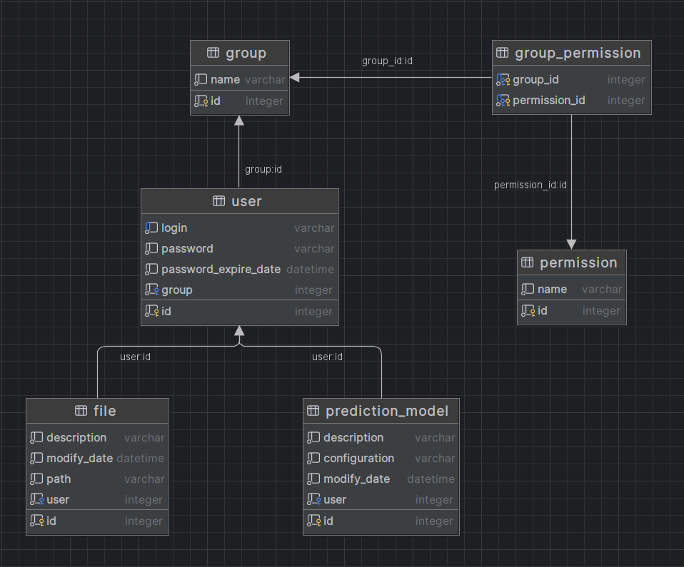

# MedicalDataAnalysis

## Description
Project for IO

### Requirements
- Python 3.11.0
- Node.js 20.9.0

### Installation (on Windows)
- Clone repository
- Run file reinstall.bat (file installs virtual enviroment for python and node scripts for react project) 
- To open frontend and backend servers, run file run_all.bat
- To open one of servers, run file run_backend.bat/run_frontend.bat

## Database schema
Current schema for database

